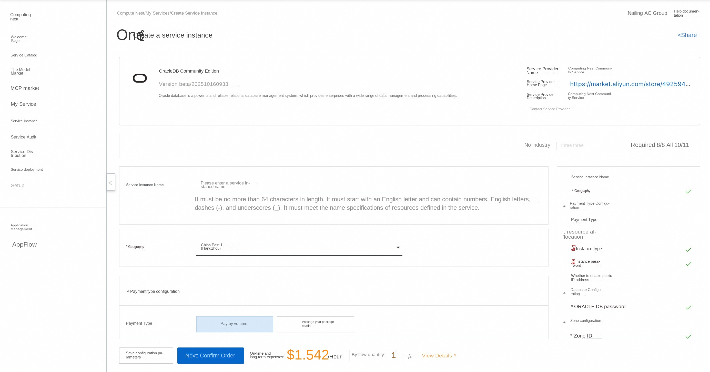
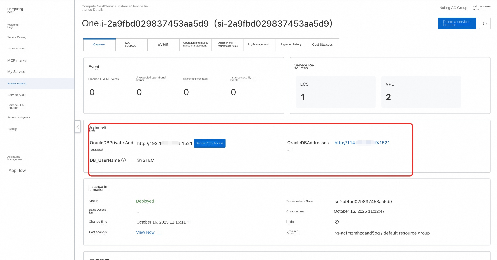
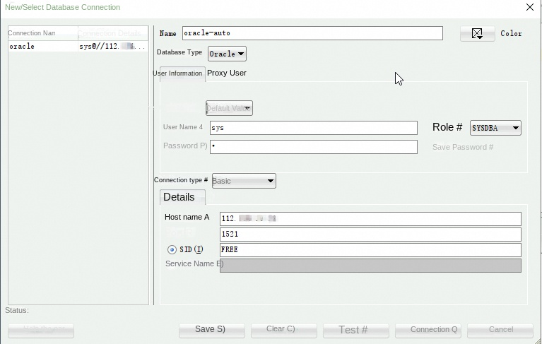

##🌟Service Introduction

Oracle Database is a powerful and highly reliable relational database management system that provides enterprises with a wide range of data management and processing capabilities.

##🚀Deployment Process

1. Visit the Computing Nest OracleDB Community Edition [Deployment Link](https://computenest.console.aliyun.com/service/instance/create/cn-hangzhou?type=user&ServiceId=service-e5dbaa9276cf4c1b8353) and fill in the deployment parameters as prompted:

2. After completing the parameters, you can see the corresponding RFQ details. After confirming the parameters, click **Next: Confirm Order**.

3. Confirm that the order is complete and agree to the service agreement and click **Create Now** to enter the deployment phase.

4. Wait for the deployment to complete and enter the service instance details page.

5. Copy the link address and remotely link the database:

Visit the Oracle SQL Developer (https://www.oracle.com/cn/database/sqldeveloper/technologies/download/) page, select the desired version to download and install.

After the installation is complete, connect to the Oracle database, as shown in the following figure.

#📚Guidelines for use

For more use, please refer to the OracleDB [official website document](https://www.oracle.com/technetwork/cn/documentation/index-090034-zhs.html).