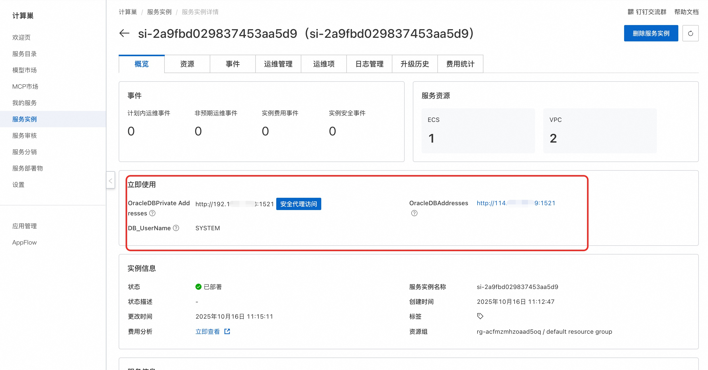
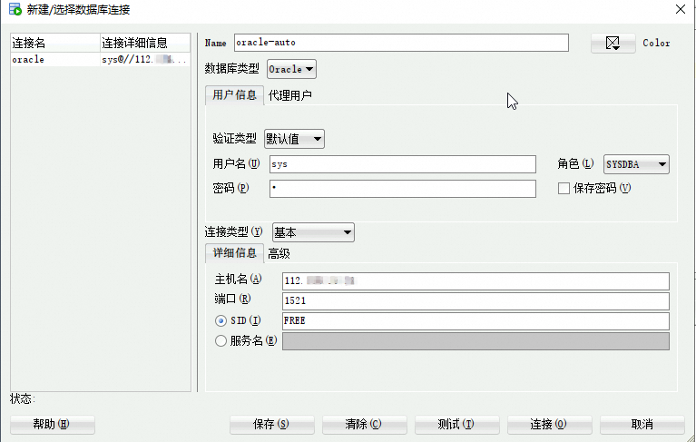

## 🌟 服务简介

Oracle数据库是一种功能强大、可靠性高的关系型数据库管理系统，为企业提供了广泛的数据管理和处理能力。

## 🚀 部署流程

1. 访问计算巢OracleDB社区版[部署链接](https://computenest.console.aliyun.com/service/instance/create/cn-hangzhou?type=user&ServiceId=service-e5dbaa9276cf4c1b8353)，按提示填写部署参数：
   

2. 参数填写完成后可以看到对应询价明细，确认参数后点击**下一步：确认订单**。

3. 确认订单完成后同意服务协议并点击**立即创建**进入部署阶段。

4. 等待部署完成后进入服务实例详情页。
   

5. 复制链接地址并远程链接数据库：

    访问[Oracle SQL Developer](https://www.oracle.com/cn/database/sqldeveloper/technologies/download/)页面，选择所需版本进行下载并安装。 

    安装完成后，连接Oracle数据库，如下图所示。
    

# 📚 使用指南

更多用法请参考OracleDB[官网文档](https://www.oracle.com/technetwork/cn/documentation/index-090034-zhs.html)。